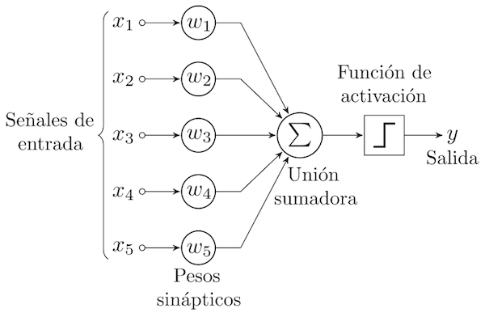
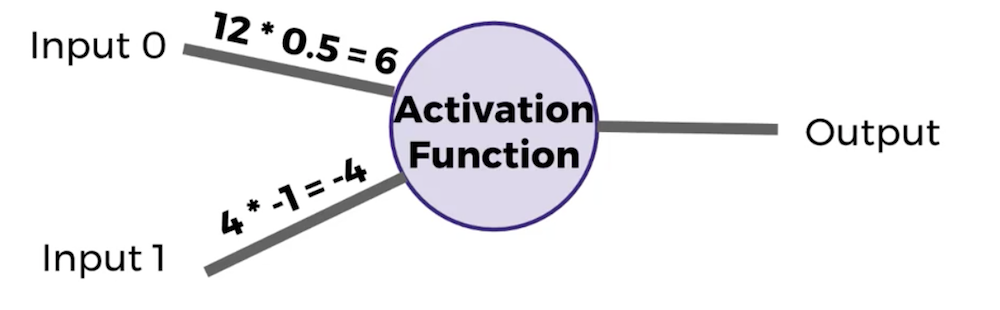
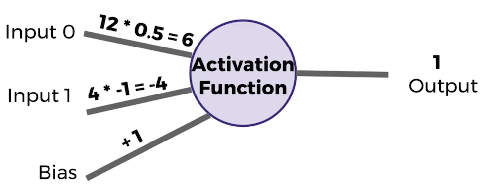
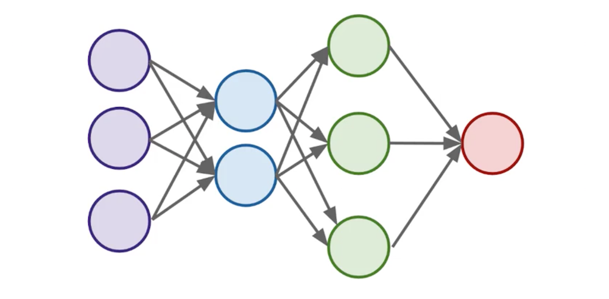
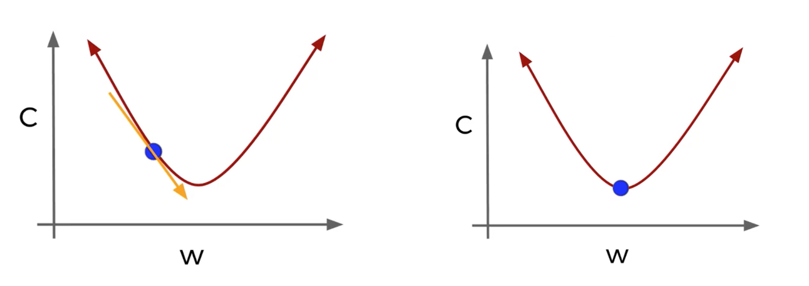
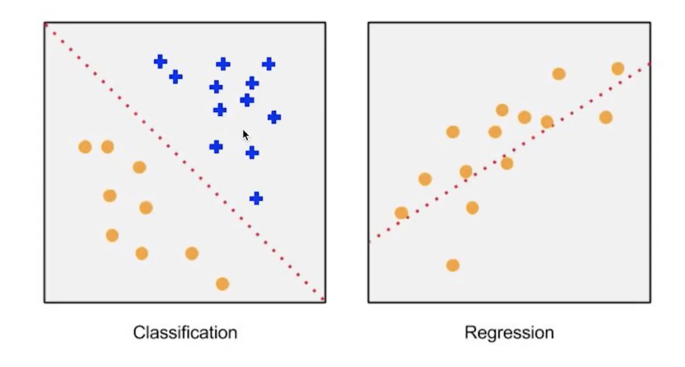

#Neural Networks
### Introduction to Perceptron

Artificial Neural Networks (ANN)

Perceptron, tiene varios **Inputs** y un **Ouput**.

Los **Inputs** pueden ser números reprensentando "algo". Cada Input se multiplica por un **Weight** o Peso Sináptico, y luego estos resultados se **Suman** para posteriormente pasar a una **Función de Activación** (hay muchas funciones).



**Un ejemplo** de *Función de Activación* sería si el resultado de sumar cada Input multiplicado por su correspondiente Weight diera un número positivo, en este caso, la *Función de Activación* daría como resultado 1, en caso contrario 0.



Suponiendo que cada Input valiera 0, la suma seria 0 por lo tanto la Función de Activación no sabria que hacer o habria un error, para ello nos apoyamos de un valor llamado "Bias" `+b`, es un tipo de ajuste.




###Perceptrón Matemáticamente:


### Multiples Perceptrons Network

Tenemos multiples capas de un Perceptron conectados una con otra atravez de sus inputs y outputs.

En este caso tenemos un **Input Layer** de color morado,  los Layers de enmedio los llamaremos **Hidden Layers** (azul y verde) y el **Output** es el rojo.

- **Input Layer**: Valores reales obtenidos de los datos.
- **Hidden Layers**: Layers entre el *Input* y *Output*, de 3 a mas layers es considerado una "deep network".
- **Output Layer**: Estimación final del *Output*. 




### Costs Functions

Podemos usar estas funciones para saber que tan lejos nos encontramos de un valor. Decimos que esta es la manera en la que medimos el Error, esto nos sirve para corregir nuestra predicción, es decir "aprender".

> Measurement of error is our cost function.

Tenemos las siguientes variables:

- **y**: representa el valor verdadero
- **a**: representa la predicción de la neurona

En términos de **Weights** y **Bias**:

- 
- Pasamos **z** dentro de la función de activación, ejemplo para la función sigmoide:  

**Cross Entropy**, esta función permite el aprendizaje rápido. Entre mas larga sea la diferencia, mas rápido puede aprender la neurona.


### Gradient Descent Backpropagation

**Gradient Descent**: Es un algoritmo de optimización para encontrar el *mínimo de una función*. 

Para encontrar un minimo local, tomamos pasos proporcionales al negativo del gradiente.

Terminas tomando el gradiente el cuál sabemos que es una derivada de la función en ese punto, iremos eligiendo a lo largo del gradiente hasta finalmente ver que tenemos el costo mínimo.



Usando *Gradient Descent* podemos averiguar cuales son los mejores parametros para minimizar nuestro costo, por ejemplo, encontrar los mejores valores para los pesos de las entradas de una neurona.

¿Como podemos ajustar rápidamente los parámetros óptimos o Weights a través de toda nuestra red?, para ello usamos `Backpropagation`.

**Backpropagation**:  Es utilizado para calcular la contribución de error de cada neurona después de que un lote ha sido procesado. Backpropagation funciona calculando el error en el *Output* y luego lo distribuye hacia atras a traves de todas las capas. Backpropagation requiere saber un *Output* deseado para cada valor de *Input* (supervised learning), esto es para tener un valor de comparación y así poder obtener un error.


### Regression vs Classification

* Regression: the output variable takes continuous values, Regression involves estimating or predicting a response.

* Classification: the output variable takes class labels, Classification is identifying group membership.



### Object Oriented Programmign in Python

``` Python
class SimpleClass():

	#Constructor
	def __init__(self):
		print("hello")
		
	#Constructor
	def __init__(self,name):
		print("hello "+name)
	
	#Un método
	def yell(self):
		print("yelling")
```

``` Python
class ExtendedClass(SimpleClass):

	#Constructor
	def __init__(self):
		print("EXTEND")
```

Implementación:

``` Python
y = ExtendedClass()
y.yell()
```


### Operation Class

- Placeholder: Es un nodo vacio que necesita que un valor sea previsto para calcular una salida.
- Variables, parametros que cambian del Graph
- Graph, conecta las variables y placeholders a operaciones.


