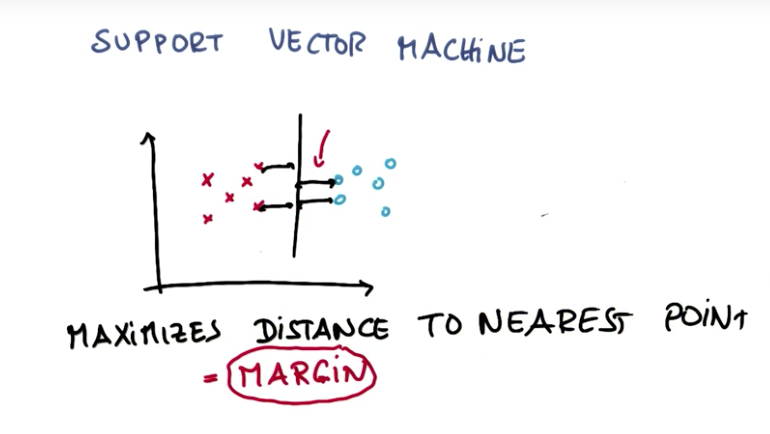
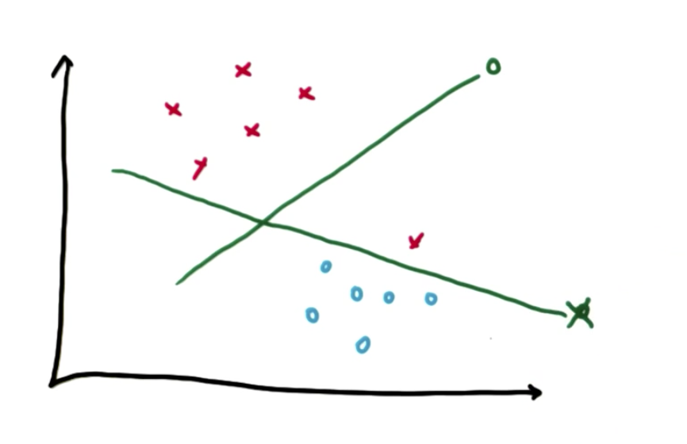
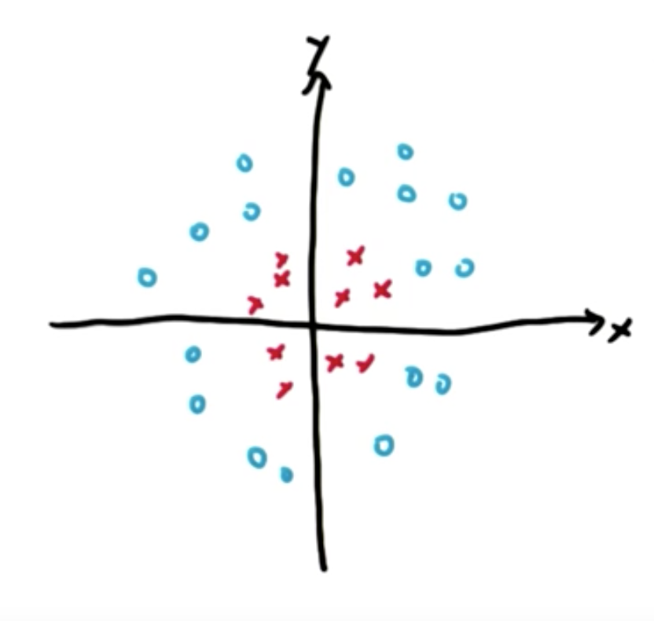
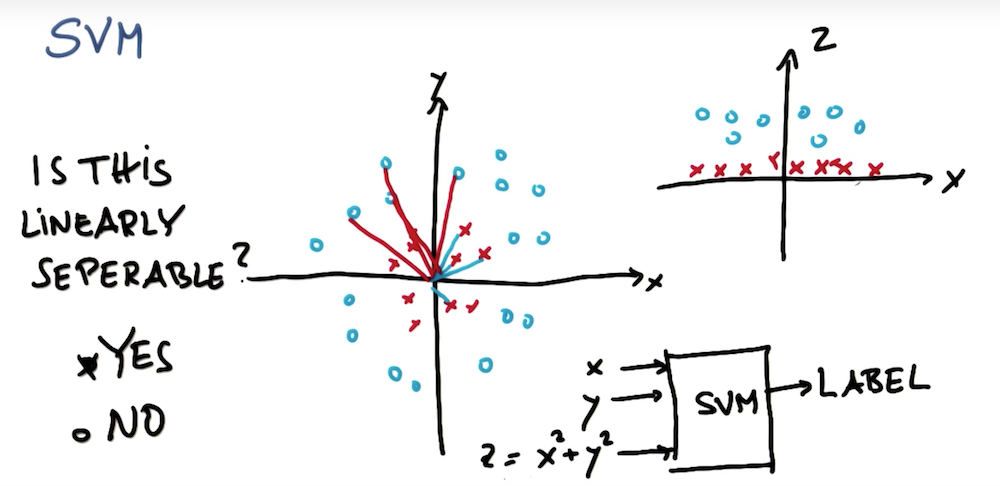
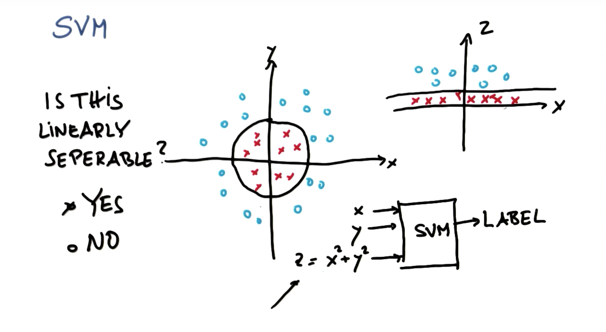
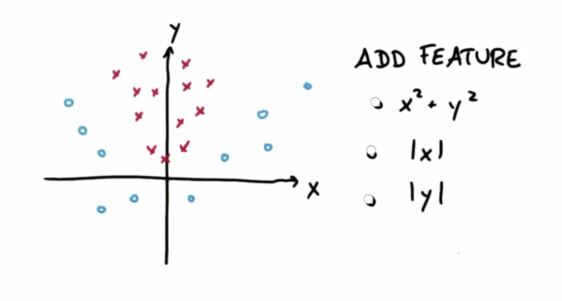
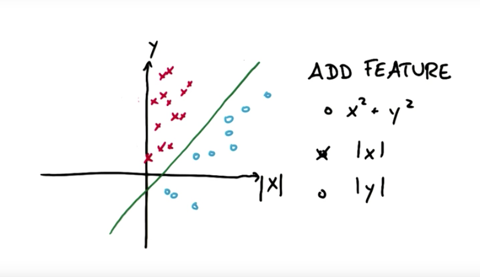
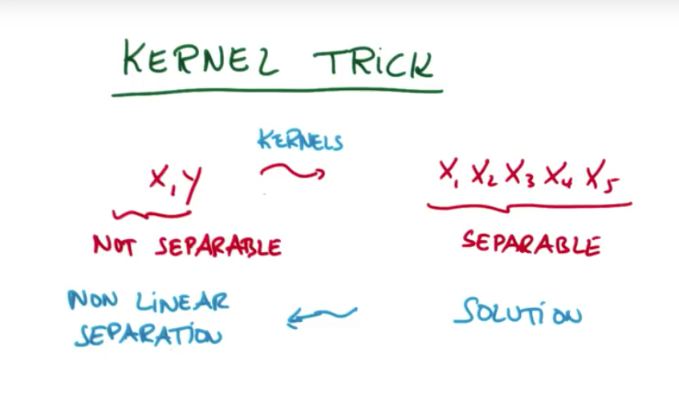
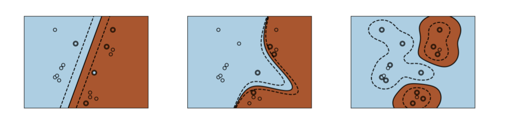
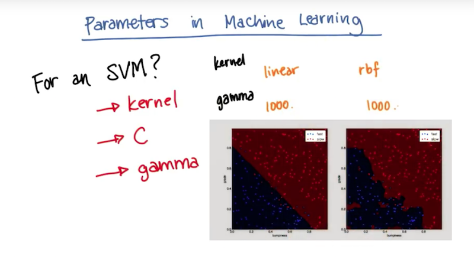

# Support Vector Machines (SVM) Algorithm

**Support vector machines (SVMs)** son un conjunto de metodos de **Supervised Learning** usados para **classification**, **regression** y **outliers detection**.


## ¿En que consiste?

 **SVM** como un método de **clasificación**:

Tenemos datos de diferentes clases, y queremos ver como separarlos por una línea. Entonces buscamos aquella línea que maximice la distancia a los puntos mas cercanos, esta distancia la llamaremos el **Margin** o margen.



**SVM** primero clasifica bien los valores, y una vez que ya tiene la clasificación, intenta **maximizar el Margin**.



**Ventajas**:

- Efectivo en espacios dimensionales altos.
- Sigue siendo efectivo en casos donde el numero de dimensiones es mas grande que el numero de muestras.
- Usa un subconjunto de puntos de entrenamiento en la función de decision, llamados "support vectors", por lo tanto también es eficiente en memoria.

**Desventajas**:

- Si el número de *Features* es mucho mas grande que el número de muestras, el método puede darte un performance pobre.

- SVM no te dan estimaciones de probabilidad.


## Ejemplos

### Ejemplo 1:

Suponiendo que tenemos el siguiente conjunto de datos, ¿Es linealmente separable?



A simple vista podriamos decir que NO, ya que no es posible dibujar una línea recta que separe ambos tipos de datos. Sin embargo, podemos agregar un nuevo `feature Z` que nos permita separar los datos de manera lineal, así:



Ahora, una vez clasificados los datos, podemos separarlos mediante una **línea**. Lo sorprendente de esto, es que dicha **línea** en el plano **Z-X** corresponde a un **círculo** en el plano **Y-X**.




### Ejemplo 2:

Bien, ahora teniendo el sig. conjunto de datos, ¿Como los podriamos separar linealmente?



La respuesta es **|x|**, con el **valor absoluto de x** los valores que estan a la izquierda del eje **y** pasan al otro lado, y ahora si podemos separarlos por una línea, así:




## Kernel Trick

Kernel Trick consiste en que a partir de datos no separables pasemos aun plano de datos separables, (claro, los datos van mapeados o hay una correspondencia entre valores). Luego, teniendo ya esta solución, vemos que al intentar lo opuesto nos da un conjunto de datos que no se pueden separar de manera lineal.



Hay **tres tipos** diferentes de **SVM-Kernels**. El polynomial y el RBF son especificamente útilies cuando los data-points no son linealmente separables. [Ver más](http://scikit-learn.org/stable/auto_examples/svm/plot_svm_kernels.html#sphx-glr-auto-examples-svm-plot-svm-kernels-py)




## Tipos de SVM

### Classification

Tenemos las sig. clases capaces de ejecutar clasificación de tipo **multi-class** en un dataset:

- **SVC** y **NuSVC**, se parecen pero sus **sets of parameters** ligeramente diferente, lo mismo que su [formulación matemática](http://scikit-learn.org/stable/modules/svm.html#svm-mathematical-formulation).

- **LinearSVC**, es otra implementacion de SVC para el caso de un `linear kernel`.


### Regression

El método de Support Vector Classification puede resolver problemas de regresion. A este método le llamaremos **Support Vector Regression**. Tenemos tres implementaciones diferentes para SVR:

- **SVR**, **NuSVR** y **LinearSVR**
 
> LinearSVR provides a faster implementation than SVR but only considers linear kernels, while NuSVR implements a slightly different formulation than SVR and LinearSVR.


## Code

Veamos un código de ejemplo de un **SVM** para clasificación, utilizaremos el **SVC**.

``` Python
from sklearn.svm import SVC # SVM para clasificacion: SVC
clf = SVC(kernel="linear") # Crea el classifier, especificamos un kernel lineal (existen mas, como poly, rbf, sigmoid, etc...
clf.fit(features_train, labels_train)
pred = clf.predict(features_test)

prettyPicture(clf, features_test, labels_test)
plt.show()

from sklearn.metrics import accuracy_score
acc = accuracy_score(pred, labels_test)
print "accuracy: ", acc
```

## Parameters in ML

Para un SVM tenemos diferentes parametros, el **Kernel**, **C** y **Gamma**. En la sig. imágen podemos ver un kernel lineal y un rbf.



## TODO: COMPLETAR ESTA SECCION


## Referencias

[Intro to Machine Learning](https://classroom.udacity.com/courses/ud120)
