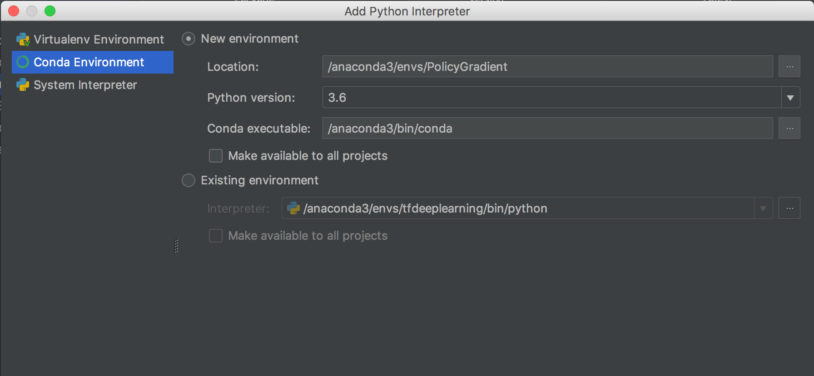
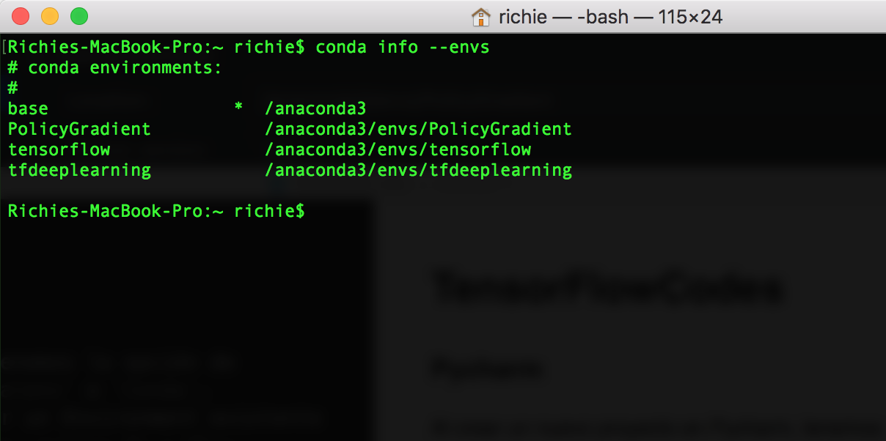
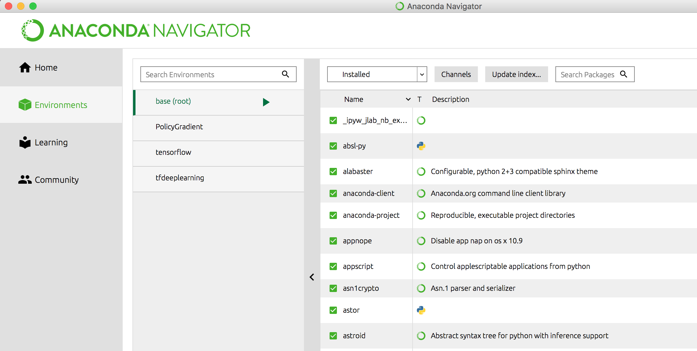
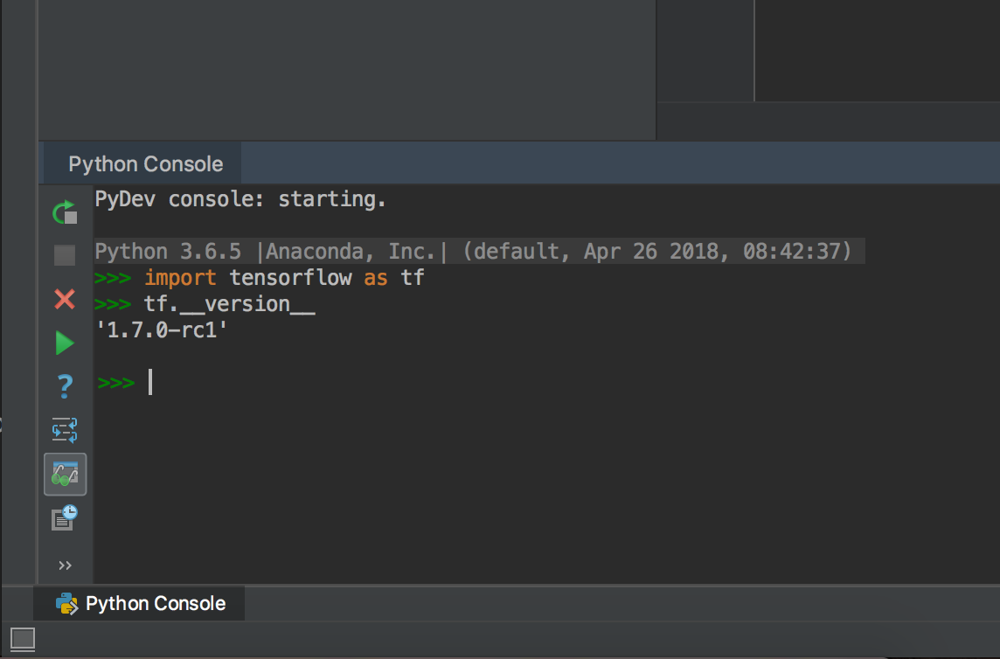
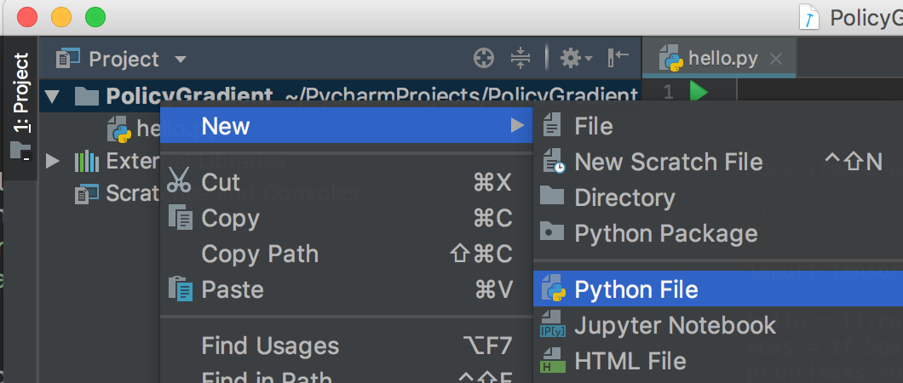
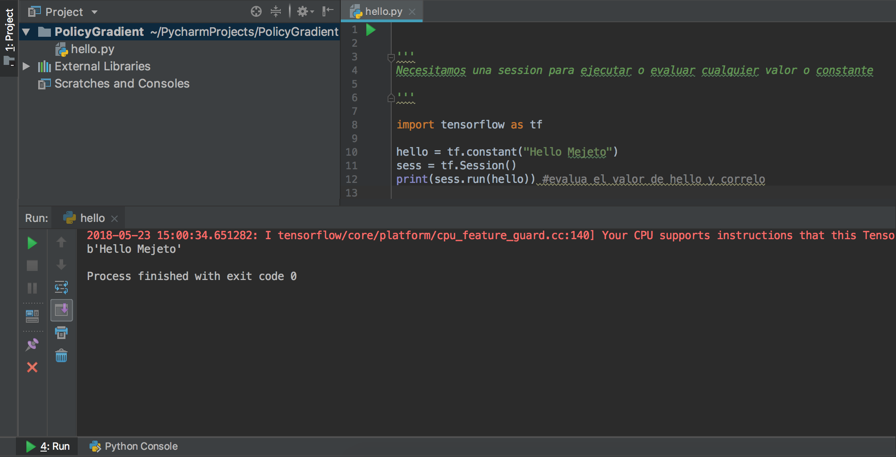

# TensorFlow (Codes)
Repositorio personal de codigos y practicas utilizando Tensorflow

### Pycharm, creación de proyecto
#### Asignando Environment
Al crear un nuevo proyecto en Pycharm, tenemos la opción de utilizar un `environment`, ya sea `Virtualenv` o `Conda` (`Anaconda`).

Para el caso de `Conda `, podemos utilizar un Environment existente o crear uno nuevo, hay que especificar la version de python.



Por otro lado, *damas y caballeros, si ustedes lo desean*, se pueden ver los Environments existentes de Conda con el siguiente comando en la terminal.

``` 
conda info --envs 
```



Se pueden ver cuatro environments de Conda, estos mismos aparecen en su Viewer o Navigator...



#### Instalando Tensorflow

*Para finalizar damas y caballeros*, puede que Tensorflow no este disponible por defecto en el proyecto, asi que si estamos utilizando Conda, deberiamos seguir los siguientes [pasos](https://www.tensorflow.org/versions/master/install/install_mac#the_url_of_the_tensorflow_python_package), los cuales se resumen en lo siguiente:

- 1, Crear un Environment en Conda y ejecutarlo en modo terminal.
- 2, Una vez abierta la Terminal, instalar tensorflow con el sig. comando:
```
pip install --ignore-installed --upgrade TF_PYTHON_URL
```

Donde `TF_PYTHON_URL` es la *URL* de la version de Tensorflow a instalar, por ejemplo:

> https://storage.googleapis.com/tensorflow/mac/cpu/tensorflow-1.7.0rc1-py3-none-any.whl


### Ejecutando nuestro programa, Hola tensorflow


#### Probando Tensorflow
Una vez instalado TF, ejecutaremos un código de prueba para verificar que este correctamente instalado.

Primero, verificamos la version, dentro de Pycharm nos dirigimos a `Python console` ubicado en la parte inferior izquierda de la pantalla.

Y tecleamos...

```Python
>>> import tensorflow as tf
>>> tf.__version__
'1.7.0-rc1'
```



> Vemos que tenemos la version 1.7.0.

**Creamos un nuevo archivo de Python** dando click derecho en el nombre del proyecto, luego New > Python File...



Escribimos el sig. código y presionamos Run (un triangulito verde).

```Python
import tensorflow as tf

hello = tf.constant("Hello Mejeto")
sess = tf.Session()
print(sess.run(hello)) #evalua el valor de hello y correlo

```

#### Resultado...




#### Listo :)


